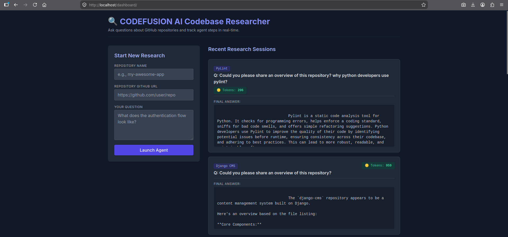

# CodeFusion AI - Codebase Research Agent

A Django-based REST API service that acts as an autonomous agent to research GitHub repositories. It utilizes the Gemini API to intelligently navigate codebases, read files, and answer architectural or technical questions based on the repository's contents.

---

## Prerequisites

- Docker and Docker Compose installed on your machine.
- Git installed.

---

## Project Setup & Running Locally

### 1. Clone the Repository

```bash
git clone <your-repository-url>
cd codefusion-ai
```

### 2. Configure Environment Variables

This project relies on environment variables for database credentials and API keys. A sample environment file is provided in the repository.

You must copy it and fill in your actual API keys (**do NOT commit your real `.env` file**).

```bash
cp .env.example .env
```

Make sure to open the `.env` file and add your valid `GEMINI_API_KEY` and `SECRET_KEY`.

### 3. Build and Start the Application

Start the application using Docker Compose. This will build the web image, start the PostgreSQL database, and run the Django web server.

```bash
docker compose up --build -d
```

### 4. API Documentation

Interactive API documentation is available through Swagger/OpenAPI UI.

Using the API docs, developers can:

- Explore available endpoints
- Test API requests directly from the browser
- View request/response schemas
- Authenticate and interact with secured endpoints

Access the API documentation locally at:

```text
http://localhost/api/docs/
```

### 5. Superuser to Access the Admin Site

To access the Django admin panel, create a superuser account using the following command:

```bash
docker compose run --rm web python manage.py createsuperuser
```

Follow the prompts to set a username, email, and password.

Once created, access the Django admin panel at:

```text
http://localhost/admin/
```

Log in using the superuser credentials you created.

### 6. Running Tests

The test suite is built with `pytest` and runs inside isolated Docker containers.

```bash
docker compose run --rm web pytest -v tests/
```

### 7. Frontend Dashboard UI

The project also includes a frontend dashboard UI to interact with the AI research agent directly from the browser.

Using the dashboard, users can:

- Submit GitHub repository URLs
- Ask repository-related technical questions
- View AI-generated answers
- Track recent research sessions and token usage

Access the dashboard locally at:

```text
http://localhost/dashboard/
```

Example Dashboard UI:



---

# API Endpoints

## 1. Create a Research Session

Triggers the AI agent to start researching a repository based on a specific question.

- **URL:** `/api/v1/agent/sessions/`
- **Method:** `POST`
- **Headers:** `Content-Type: application/json`

### Request Payload

```json
{
	"repository_url": "https://github.com/pylint-dev/pylint",
	"repository_name": "PyLint",
	"question": "Could you please share an overview of this repository? Why python developers use pylint?"
}
```

### Response Payload (`201 Created`)

```json
{
	"id": 14,
	"repository": {
		"id": 66,
		"url": "https://github.com/pylint-dev/pylint/",
		"name": "PyLint"
	},
	"question": "Could you please share an overview of this repository? why python developers use pylint?",
	"final_answer": "Pylint is a static code analysis tool for Python. It checks for programming errors, helps enforce a coding standard, sniffs for bad code smells, and offers simple refactoring suggestions. Python developers use Pylint to improve the quality of their code by identifying potential issues before runtime, ensuring consistency across their codebase, and adhering to best practices. This can lead to more robust, readable, and maintainable software.",
	"token_usage": 206,
	"findings": [
		{
			"id": 33,
			"tool_name": "list_github_files",
			"input_data": {
				"repo_url": "https://github.com/pylint-dev/pylint/"
			},
			"output_data": ".coveragerc\n.git-blame-ignore-revs\n.gitattributes\n.github/CODEOWNERS\n.github/CONTRIBUTING.md\n.github/FUNDING.yml\n.github/ISSUE_TEMPLATE/BUG-REPORT.yml\n.github/ISSUE_TEMPLATE/FEATURE-REQUEST.yml\n.github/ISSUE_TEMPLATE/QUESTION.yml\n.github/ISSUE_TEMPLATE/config.yml\n.github/PULL_REQUEST_TEMPLATE.md\n.github/SECURITY.md\n.github/copilot-instructions.md\n.github/dependabot.yml\n.github/workflows/backport.yml\n.github/workflows/changelog.yml\n.github/workflows/checks.yaml\n.github/workflows/codeql-analysis.yml\n.github/workflows/primer-test.yaml\n.github/workflows/primer_comment.yaml\n.github/workflows/primer_run_main.yaml\n.github/workflows/primer_run_pr.yaml\n.github/workflows/release.yml\n.github/workflows/stale.yml\n.github/workflows/tests.yaml\n.gitignore\n.pre-commit-config.yaml\n.pre-commit-hooks.yaml\n.readthedocs.yaml\nCITATION.cff\nCODE_OF_CONDUCT.md\nCONTRIBUTORS.txt\nLICENSE\nMANIFEST.in\nREADME.rst\ncodecov.yml\ncustom_dict.txt\ndoc/Makefile\ndoc/additional_tools/pyreverse/configuration.rst\ndoc/additional_tools/pyreverse/index.rst\ndoc/additional_tools/pyreverse/output_examples.rst\ndoc/additional_tools/symilar/index.rst\ndoc/conf.py\ndoc/contact.rst\ndoc/data/messages/a/abstract-class-instantiated/bad.py\ndoc/data/messages/a/abstract-class-instantiated/good.py\ndoc/data/messages/a/abstract-method/bad/abstract_method.py\ndoc/data/messages/a/abstract-method/bad/function_raising_not_implemented_error.py\ndoc/data/messages/a/abstract-method/good/abstract_method.py\ndoc/data/messages/a/abstract-method/good/function_raising_not_implemented_error.py\ndoc/data/messages/a/access-member-before-definition/bad.py\ndoc/data/messages/a/access-member-before-definition/good.py\ndoc/data/messages/a/anomalous-backslash-in-string/bad.py\ndoc/data/messages/a/anomalous-backslash-in-string/details.rst\ndoc/data/messages/a/anomalous-backslash-in-string/good/double_escape.py\ndoc/data/messages/a/anomalous-backslash-in-string/good/existing_escape_sequence.py\ndoc/data/messages/a/anomalous-backslash-in-string/good/r_prefix.py\ndoc/data/messages/a/anomalous-backslash-in-string/related.rst\ndoc/data/messages/a/anomalous-unicode-escape-in-string/bad.py\ndoc/data/messages/a/anomalous-unicode-escape-in-string/good.py\ndoc/data/messages/a/arguments-differ/bad.py\ndoc/data/messages/a/arguments-differ/details.rst\ndoc/data/messages/a/arguments-differ/good/add_option_in_base_class.py\ndoc/data/messages/a/arguments-differ/good/default_value.py\ndoc/data/messages/a/arguments-differ/good/no_inheritance.py\ndoc/data/messages/a/arguments-differ/related.rst\ndoc/data/messages/a/arguments-out-of-order/bad.py\ndoc/data/messages/a/arguments-out-of-order/good.py\ndoc/data/messages/a/arguments-renamed/bad.py\ndoc/data/messages/a/arguments-renamed/good.py\ndoc/data/messages/a/assert-on-string-literal/bad.py\ndoc/data/messages/a/assert-on-string-literal/details.rst\ndoc/data/messages/a/assert-on-string-literal/good.py\ndoc/data/messages/a/assert-on-string-literal/related.rst\ndoc/data/messages/a/assert-on-tuple/bad.py\ndoc/data/messages/a/assert-on-tuple/details.rst\ndoc/data/messages/a/assert-on-tuple/good.py\ndoc/data/messages/a/assigning-non-slot/bad.py\ndoc/data/messages/a/assigning-non-slot/good.py\ndoc/data/messages/a/assignment-from-no-return/bad.py\ndoc/data/messages/a/assignment-from-no-return/good.py\ndoc/data/messages/a/assignment-from-none/bad.py\ndoc/data/messages/a/assignment-from-none/good.py\ndoc/data/messages/a/astroid-error/details.rst\ndoc/data/messages/a/async-context-manager-with-regular-with/bad.py\ndoc/data/messages/a/async-context-manager-with-regular-with/good.py\ndoc/data/messages/a/async-context-manager-with-regular-with/related.rst\ndoc/data/messages/a/attribute-defined-outside-init/bad.py\ndoc/data/messages/a/attribute-defined-outside-init/good.py\ndoc/data/messages/a/await-outside-async/bad.py\ndoc/data/messages/a/await-outside-async/good.py\ndoc/data/messages/a/await-outside-async/related.rst\ndoc/data/messages/b/bad-builtin/bad.py\ndoc/data/messages/b/bad-builtin/good.py\ndoc/data/messages/b/bad-builtin/pylintrc\ndoc/data/messages/b/bad-chained-comparison/bad/parrot.py\ndoc/data/messages/b/bad-chained-comparison/bad/xor.py\ndoc/data/messages/b/bad-chained-comparison/good/parrot.py\ndoc/data/messages/b/bad-chained-comparison/good/xor.py\ndoc/data/messages/b/bad-chained-comparison/related.rst",
			"conclusion": "Agent utilized list_github_files during step 2.",
			"created_at": "2026-05-21T15:55:30.056319+06:00"
		},
		{
			"id": 32,
			"tool_name": "get_previous_findings",
			"input_data": {
				"repo_url": "https://github.com/pylint-dev/pylint/"
			},
			"output_data": "No previous research found for this repository.",
			"conclusion": "Agent utilized get_previous_findings during step 1.",
			"created_at": "2026-05-21T15:55:26.172449+06:00"
		}
	],
	"created_at": "2026-05-21T15:55:23.888942+06:00"
}
```

---

## 2. List All Research Sessions

Retrieves a paginated list of all past research sessions.

- **URL:** `/api/v1/agent/sessions/?page_size=2`
- **Method:** `GET`

### Response Payload (`200 OK`)

```json
{
	"next": "http://localhost/api/v1/agent/sessions/?cursor=cD0yMDI2LTA1LTIwKzIxJTNBMDIlM0EyNy4wNTc2MjclMkIwMCUzQTAw&page_size=2",
	"previous": null,
	"results": [
		{
			"id": 14,
			"repository": {
				"id": 66,
				"url": "https://github.com/pylint-dev/pylint/",
				"name": "PyLint"
			},
			"question": "Could you please share an overview of this repository? why python developers use pylint?",
			"final_answer": "Pylint is a static code analysis tool for Python. It checks for programming errors, helps enforce a coding standard, sniffs for bad code smells, and offers simple refactoring suggestions. Python developers use Pylint to improve the quality of their code by identifying potential issues before runtime, ensuring consistency across their codebase, and adhering to best practices. This can lead to more robust, readable, and maintainable software.",
			"token_usage": 206,
			"findings": [
				{
					"id": 33,
					"tool_name": "list_github_files",
					"input_data": {
						"repo_url": "https://github.com/pylint-dev/pylint/"
					},
					"output_data": ".coveragerc\n.git-blame-ignore-revs\n.gitattributes\n.github/CODEOWNERS\n.github/CONTRIBUTING.md\n.github/FUNDING.yml\n.github/ISSUE_TEMPLATE/BUG-REPORT.yml\n.github/ISSUE_TEMPLATE/FEATURE-REQUEST.yml\n.github/ISSUE_TEMPLATE/QUESTION.yml\n.github/ISSUE_TEMPLATE/config.yml\n.github/PULL_REQUEST_TEMPLATE.md\n.github/SECURITY.md\n.github/copilot-instructions.md\n.github/dependabot.yml\n.github/workflows/backport.yml\n.github/workflows/changelog.yml\n.github/workflows/checks.yaml\n.github/workflows/codeql-analysis.yml\n.github/workflows/primer-test.yaml\n.github/workflows/primer_comment.yaml\n.github/workflows/primer_run_main.yaml\n.github/workflows/primer_run_pr.yaml\n.github/workflows/release.yml\n.github/workflows/stale.yml\n.github/workflows/tests.yaml\n.gitignore\n.pre-commit-config.yaml\n.pre-commit-hooks.yaml\n.readthedocs.yaml\nCITATION.cff\nCODE_OF_CONDUCT.md\nCONTRIBUTORS.txt\nLICENSE\nMANIFEST.in\nREADME.rst\ncodecov.yml\ncustom_dict.txt\ndoc/Makefile\ndoc/additional_tools/pyreverse/configuration.rst\ndoc/additional_tools/pyreverse/index.rst\ndoc/additional_tools/pyreverse/output_examples.rst\ndoc/additional_tools/symilar/index.rst\ndoc/conf.py\ndoc/contact.rst\ndoc/data/messages/a/abstract-class-instantiated/bad.py\ndoc/data/messages/a/abstract-class-instantiated/good.py\ndoc/data/messages/a/abstract-method/bad/abstract_method.py\ndoc/data/messages/a/abstract-method/bad/function_raising_not_implemented_error.py\ndoc/data/messages/a/abstract-method/good/abstract_method.py\ndoc/data/messages/a/abstract-method/good/function_raising_not_implemented_error.py\ndoc/data/messages/a/access-member-before-definition/bad.py\ndoc/data/messages/a/access-member-before-definition/good.py\ndoc/data/messages/a/anomalous-backslash-in-string/bad.py\ndoc/data/messages/a/anomalous-backslash-in-string/details.rst\ndoc/data/messages/a/anomalous-backslash-in-string/good/double_escape.py\ndoc/data/messages/a/anomalous-backslash-in-string/good/existing_escape_sequence.py\ndoc/data/messages/a/anomalous-backslash-in-string/good/r_prefix.py\ndoc/data/messages/a/anomalous-backslash-in-string/related.rst\ndoc/data/messages/a/anomalous-unicode-escape-in-string/bad.py\ndoc/data/messages/a/anomalous-unicode-escape-in-string/good.py\ndoc/data/messages/a/arguments-differ/bad.py\ndoc/data/messages/a/arguments-differ/details.rst\ndoc/data/messages/a/arguments-differ/good/add_option_in_base_class.py\ndoc/data/messages/a/arguments-differ/good/default_value.py\ndoc/data/messages/a/arguments-differ/good/no_inheritance.py\ndoc/data/messages/a/arguments-differ/related.rst\ndoc/data/messages/a/arguments-out-of-order/bad.py\ndoc/data/messages/a/arguments-out-of-order/good.py\ndoc/data/messages/a/arguments-renamed/bad.py\ndoc/data/messages/a/arguments-renamed/good.py\ndoc/data/messages/a/assert-on-string-literal/bad.py\ndoc/data/messages/a/assert-on-string-literal/details.rst\ndoc/data/messages/a/assert-on-string-literal/good.py\ndoc/data/messages/a/assert-on-string-literal/related.rst\ndoc/data/messages/a/assert-on-tuple/bad.py\ndoc/data/messages/a/assert-on-tuple/details.rst\ndoc/data/messages/a/assert-on-tuple/good.py\ndoc/data/messages/a/assigning-non-slot/bad.py\ndoc/data/messages/a/assigning-non-slot/good.py\ndoc/data/messages/a/assignment-from-no-return/bad.py\ndoc/data/messages/a/assignment-from-no-return/good.py\ndoc/data/messages/a/assignment-from-none/bad.py\ndoc/data/messages/a/assignment-from-none/good.py\ndoc/data/messages/a/astroid-error/details.rst\ndoc/data/messages/a/async-context-manager-with-regular-with/bad.py\ndoc/data/messages/a/async-context-manager-with-regular-with/good.py\ndoc/data/messages/a/async-context-manager-with-regular-with/related.rst\ndoc/data/messages/a/attribute-defined-outside-init/bad.py\ndoc/data/messages/a/attribute-defined-outside-init/good.py\ndoc/data/messages/a/await-outside-async/bad.py\ndoc/data/messages/a/await-outside-async/good.py\ndoc/data/messages/a/await-outside-async/related.rst\ndoc/data/messages/b/bad-builtin/bad.py\ndoc/data/messages/b/bad-builtin/good.py\ndoc/data/messages/b/bad-builtin/pylintrc\ndoc/data/messages/b/bad-chained-comparison/bad/parrot.py\ndoc/data/messages/b/bad-chained-comparison/bad/xor.py\ndoc/data/messages/b/bad-chained-comparison/good/parrot.py\ndoc/data/messages/b/bad-chained-comparison/good/xor.py\ndoc/data/messages/b/bad-chained-comparison/related.rst",
					"conclusion": "Agent utilized list_github_files during step 2.",
					"created_at": "2026-05-21T15:55:30.056319+06:00"
				},
				{
					"id": 32,
					"tool_name": "get_previous_findings",
					"input_data": {
						"repo_url": "https://github.com/pylint-dev/pylint/"
					},
					"output_data": "No previous research found for this repository.",
					"conclusion": "Agent utilized get_previous_findings during step 1.",
					"created_at": "2026-05-21T15:55:26.172449+06:00"
				}
			],
			"created_at": "2026-05-21T15:55:23.888942+06:00"
		},
		{
			"id": 13,
			"repository": {
				"id": 65,
				"url": "https://github.com/django-cms/django-cms",
				"name": "Django CMS"
			},
			"question": "Could you please share an overview of this repository?",
			"final_answer": "The `django-cms` repository appears to be a content management system built on Django.\n\nHere's an overview based on the file listing:\n\n**Core Components:**\n\n*   **`cms/` directory:** This is the heart of the project, containing the main Django application.\n    *   **`admin/`:** Likely handles the administration interface for managing content, users, permissions, and settings within the CMS.\n    *   **`api.py`:** Provides an API for interacting with the CMS programmatically.\n    *   **`app_base.py`, `app_registration.py`, `apphook_pool.py`, `appresolver.py`:** These files suggest a system for integrating and managing \"apphooks,\" which allow Django applications to be easily integrated into the CMS.\n    *   **`cache/`:** Implements caching mechanisms for various components like pages, permissions, and placeholders to improve performance.\n    *   **`cms_config.py`, `cms_menus.py`, `cms_plugins.py`, `cms_toolbars.py`, `cms_wizards.py`:** These indicate core CMS functionalities like configuration, menu management, plugin system, toolbar customization, and guided wizards.\n    *   **`constants.py`, `exceptions.py`:** Define constants and custom exceptions used throughout the CMS.\n    *   **`extensions/`:** Provides a way to extend CMS functionalities, potentially through custom models, admin interfaces, and toolbars.\n    *   **`forms/`:** Contains various forms used in the CMS for user input, login, and wizard steps.\n    *   **`models/`:** (Not explicitly listed as a directory, but implied by `extensions/models.py` and a CMS project) This would contain the Django models defining the data structure of pages, content, users, etc.\n\n**Internationalization (i18n):**\n\n*   **`cms/locale/`:** Contains translation files (`.mo` and `.po`) for various languages (e.g., Afrikaans, Arabic, Belarusian, Bengali, Bulgarian). This indicates strong support for multiple languages.\n\n**Build and Development Tools:**\n\n*   **`.github/workflows/`:** This directory contains GitHub Actions workflows for:\n    *   `codeql.yml`: Code quality analysis.\n    *   `docs.yml`: Documentation generation/deployment.\n    *   `frontend.yml`: Frontend asset compilation/testing.\n    *   `lint-pr.yml`, `linters.yml`: Code linting.\n    *   `make-release.yml`, `publish-to-live-pypi.yml`, `publish-to-test-pypi.yml`, `releases.yml`: Release management and publishing to PyPI.\n    *   `test.yml`, `test_startcmsproject.yml`: Running tests.\n*   **`.babelrc`, `.coveragerc`, `.coveralls.yml`, `.editorconfig`, `.gitignore`, `.landscape.yaml`, `.nvmrc`, `.pre-commit-config.yaml`, `.readthedocs.yaml`, `.tx/config`, `MANIFEST.in`:** These files are configuration files for various development tools, testing, code coverage, formatting, and documentation generation (Read the Docs).\n\n**Documentation and Project Information:**\n\n*   **`AUTHORS`, `CHANGELOG.rst`, `CODE_OF_CONDUCT.rst`, `CONTRIBUTING.rst`, `LICENSE`, `README.rst`, `SECURITY.md`:** These provide essential project information, including authors, change history, code of conduct, contribution guidelines, licensing, a general project description, and security policies.\n\nIn summary, `django-cms` is a mature and feature-rich Django-based CMS with strong support for internationalization, a robust plugin and extension system, and a comprehensive set of development and testing tools. It emphasizes code quality, documentation, and a well-defined release process.",
			"token_usage": 959,
			"findings": [
				{
					"id": 31,
					"tool_name": "list_github_files",
					"input_data": {
						"repo_url": "https://github.com/django-cms/django-cms"
					},
					"output_data": ".babelrc\n.coveragerc\n.coveralls.yml\n.editorconfig\n.github/FUNDING.yml\n.github/ISSUE_TEMPLATE/---bug-report.md\n.github/ISSUE_TEMPLATE/---documentation-report.md\n.github/PULL_REQUEST_TEMPLATE.md\n.github/dependabot.yml\n.github/workflows/codeql.yml\n.github/workflows/docs.yml\n.github/workflows/frontend.yml\n.github/workflows/lint-pr.yml\n.github/workflows/linters.yml\n.github/workflows/make-release.yml\n.github/workflows/new_contributor_pr.yml\n.github/workflows/publish-to-live-pypi.yml\n.github/workflows/publish-to-test-pypi.yml\n.github/workflows/releases.yml\n.github/workflows/spelling.yml\n.github/workflows/stale.yml\n.github/workflows/test.yml\n.github/workflows/test_startcmsproject.yml\n.gitignore\n.landscape.yaml\n.nvmrc\n.pre-commit-config.yaml\n.readthedocs.yaml\n.tx/config\nAUTHORS\nCHANGELOG.rst\nCODE_OF_CONDUCT.rst\nCONTRIBUTING.rst\nLICENSE\nMANIFEST.in\nREADME.rst\nSECURITY.md\ncms/__init__.py\ncms/__main__.py\ncms/admin/__init__.py\ncms/admin/forms.py\ncms/admin/pageadmin.py\ncms/admin/permissionadmin.py\ncms/admin/placeholderadmin.py\ncms/admin/settingsadmin.py\ncms/admin/useradmin.py\ncms/admin/utils.py\ncms/api.py\ncms/app_base.py\ncms/app_registration.py\ncms/apphook_pool.py\ncms/appresolver.py\ncms/apps.py\ncms/cache/__init__.py\ncms/cache/choices.py\ncms/cache/page.py\ncms/cache/permissions.py\ncms/cache/placeholder.py\ncms/cms_config.py\ncms/cms_menus.py\ncms/cms_plugins.py\ncms/cms_toolbars.py\ncms/cms_wizards.py\ncms/constants.py\ncms/context_processors.py\ncms/exceptions.py\ncms/extensions/__init__.py\ncms/extensions/admin.py\ncms/extensions/extension_pool.py\ncms/extensions/models.py\ncms/extensions/toolbar.py\ncms/forms/__init__.py\ncms/forms/fields.py\ncms/forms/login.py\ncms/forms/utils.py\ncms/forms/validators.py\ncms/forms/widgets.py\ncms/forms/wizards.py\ncms/locale/af/LC_MESSAGES/django.mo\ncms/locale/af/LC_MESSAGES/django.po\ncms/locale/af/LC_MESSAGES/djangojs.mo\ncms/locale/af/LC_MESSAGES/djangojs.po\ncms/locale/ar/LC_MESSAGES/django.mo\ncms/locale/ar/LC_MESSAGES/django.po\ncms/locale/ar/LC_MESSAGES/djangojs.mo\ncms/locale/ar/LC_MESSAGES/djangojs.po\ncms/locale/ar_SA/LC_MESSAGES/django.mo\ncms/locale/ar_SA/LC_MESSAGES/django.po\ncms/locale/ar_SA/LC_MESSAGES/djangojs.mo\ncms/locale/ar_SA/LC_MESSAGES/djangojs.po\ncms/locale/be/LC_MESSAGES/django.mo\ncms/locale/be/LC_MESSAGES/django.po\ncms/locale/be/LC_MESSAGES/djangojs.mo\ncms/locale/be/LC_MESSAGES/djangojs.po\ncms/locale/bg/LC_MESSAGES/django.mo\ncms/locale/bg/LC_MESSAGES/django.po\ncms/locale/bg/LC_MESSAGES/djangojs.mo\ncms/locale/bg/LC_MESSAGES/djangojs.po\ncms/locale/bn/LC_MESSAGES/django.mo\ncms/locale/bn/LC_MESSAGES/django.po",
					"conclusion": "Agent utilized list_github_files during step 2.",
					"created_at": "2026-05-21T03:02:32.680257+06:00"
				},
				{
					"id": 30,
					"tool_name": "get_previous_findings",
					"input_data": {
						"repo_url": "https://github.com/django-cms/django-cms"
					},
					"output_data": "No previous research found for this repository.",
					"conclusion": "Agent utilized get_previous_findings during step 1.",
					"created_at": "2026-05-21T03:02:29.792656+06:00"
				}
			],
			"created_at": "2026-05-21T03:02:27.057627+06:00"
		}
	]
}
```

---

## 3. Retrieve a Specific Research Session

Retrieves the full details of a specific research session by its ID.

- **URL:** `/api/v1/agent/sessions/<id>/`
- **Method:** `GET`

### Response Payload (`200 OK`)

```json
{
	"id": 14,
	"repository": {
		"id": 66,
		"url": "https://github.com/pylint-dev/pylint/",
		"name": "PyLint"
	},
	"question": "Could you please share an overview of this repository? why python developers use pylint?",
	"final_answer": "Pylint is a static code analysis tool for Python. It checks for programming errors, helps enforce a coding standard, sniffs for bad code smells, and offers simple refactoring suggestions. Python developers use Pylint to improve the quality of their code by identifying potential issues before runtime, ensuring consistency across their codebase, and adhering to best practices. This can lead to more robust, readable, and maintainable software.",
	"token_usage": 206,
	"findings": [
		{
			"id": 33,
			"tool_name": "list_github_files",
			"input_data": {
				"repo_url": "https://github.com/pylint-dev/pylint/"
			},
			"output_data": ".coveragerc\n.git-blame-ignore-revs\n.gitattributes\n.github/CODEOWNERS\n.github/CONTRIBUTING.md\n.github/FUNDING.yml\n.github/ISSUE_TEMPLATE/BUG-REPORT.yml\n.github/ISSUE_TEMPLATE/FEATURE-REQUEST.yml\n.github/ISSUE_TEMPLATE/QUESTION.yml\n.github/ISSUE_TEMPLATE/config.yml\n.github/PULL_REQUEST_TEMPLATE.md\n.github/SECURITY.md\n.github/copilot-instructions.md\n.github/dependabot.yml\n.github/workflows/backport.yml\n.github/workflows/changelog.yml\n.github/workflows/checks.yaml\n.github/workflows/codeql-analysis.yml\n.github/workflows/primer-test.yaml\n.github/workflows/primer_comment.yaml\n.github/workflows/primer_run_main.yaml\n.github/workflows/primer_run_pr.yaml\n.github/workflows/release.yml\n.github/workflows/stale.yml\n.github/workflows/tests.yaml\n.gitignore\n.pre-commit-config.yaml\n.pre-commit-hooks.yaml\n.readthedocs.yaml\nCITATION.cff\nCODE_OF_CONDUCT.md\nCONTRIBUTORS.txt\nLICENSE\nMANIFEST.in\nREADME.rst\ncodecov.yml\ncustom_dict.txt\ndoc/Makefile\ndoc/additional_tools/pyreverse/configuration.rst\ndoc/additional_tools/pyreverse/index.rst\ndoc/additional_tools/pyreverse/output_examples.rst\ndoc/additional_tools/symilar/index.rst\ndoc/conf.py\ndoc/contact.rst\ndoc/data/messages/a/abstract-class-instantiated/bad.py\ndoc/data/messages/a/abstract-class-instantiated/good.py\ndoc/data/messages/a/abstract-method/bad/abstract_method.py\ndoc/data/messages/a/abstract-method/bad/function_raising_not_implemented_error.py\ndoc/data/messages/a/abstract-method/good/abstract_method.py\ndoc/data/messages/a/abstract-method/good/function_raising_not_implemented_error.py\ndoc/data/messages/a/access-member-before-definition/bad.py\ndoc/data/messages/a/access-member-before-definition/good.py\ndoc/data/messages/a/anomalous-backslash-in-string/bad.py\ndoc/data/messages/a/anomalous-backslash-in-string/details.rst\ndoc/data/messages/a/anomalous-backslash-in-string/good/double_escape.py\ndoc/data/messages/a/anomalous-backslash-in-string/good/existing_escape_sequence.py\ndoc/data/messages/a/anomalous-backslash-in-string/good/r_prefix.py\ndoc/data/messages/a/anomalous-backslash-in-string/related.rst\ndoc/data/messages/a/anomalous-unicode-escape-in-string/bad.py\ndoc/data/messages/a/anomalous-unicode-escape-in-string/good.py\ndoc/data/messages/a/arguments-differ/bad.py\ndoc/data/messages/a/arguments-differ/details.rst\ndoc/data/messages/a/arguments-differ/good/add_option_in_base_class.py\ndoc/data/messages/a/arguments-differ/good/default_value.py\ndoc/data/messages/a/arguments-differ/good/no_inheritance.py\ndoc/data/messages/a/arguments-differ/related.rst\ndoc/data/messages/a/arguments-out-of-order/bad.py\ndoc/data/messages/a/arguments-out-of-order/good.py\ndoc/data/messages/a/arguments-renamed/bad.py\ndoc/data/messages/a/arguments-renamed/good.py\ndoc/data/messages/a/assert-on-string-literal/bad.py\ndoc/data/messages/a/assert-on-string-literal/details.rst\ndoc/data/messages/a/assert-on-string-literal/good.py\ndoc/data/messages/a/assert-on-string-literal/related.rst\ndoc/data/messages/a/assert-on-tuple/bad.py\ndoc/data/messages/a/assert-on-tuple/details.rst\ndoc/data/messages/a/assert-on-tuple/good.py\ndoc/data/messages/a/assigning-non-slot/bad.py\ndoc/data/messages/a/assigning-non-slot/good.py\ndoc/data/messages/a/assignment-from-no-return/bad.py\ndoc/data/messages/a/assignment-from-no-return/good.py\ndoc/data/messages/a/assignment-from-none/bad.py\ndoc/data/messages/a/assignment-from-none/good.py\ndoc/data/messages/a/astroid-error/details.rst\ndoc/data/messages/a/async-context-manager-with-regular-with/bad.py\ndoc/data/messages/a/async-context-manager-with-regular-with/good.py\ndoc/data/messages/a/async-context-manager-with-regular-with/related.rst\ndoc/data/messages/a/attribute-defined-outside-init/bad.py\ndoc/data/messages/a/attribute-defined-outside-init/good.py\ndoc/data/messages/a/await-outside-async/bad.py\ndoc/data/messages/a/await-outside-async/good.py\ndoc/data/messages/a/await-outside-async/related.rst\ndoc/data/messages/b/bad-builtin/bad.py\ndoc/data/messages/b/bad-builtin/good.py\ndoc/data/messages/b/bad-builtin/pylintrc\ndoc/data/messages/b/bad-chained-comparison/bad/parrot.py\ndoc/data/messages/b/bad-chained-comparison/bad/xor.py\ndoc/data/messages/b/bad-chained-comparison/good/parrot.py\ndoc/data/messages/b/bad-chained-comparison/good/xor.py\ndoc/data/messages/b/bad-chained-comparison/related.rst",
			"conclusion": "Agent utilized list_github_files during step 2.",
			"created_at": "2026-05-21T15:55:30.056319+06:00"
		},
		{
			"id": 32,
			"tool_name": "get_previous_findings",
			"input_data": {
				"repo_url": "https://github.com/pylint-dev/pylint/"
			},
			"output_data": "No previous research found for this repository.",
			"conclusion": "Agent utilized get_previous_findings during step 1.",
			"created_at": "2026-05-21T15:55:26.172449+06:00"
		}
	],
	"created_at": "2026-05-21T15:55:23.888942+06:00"
}
```